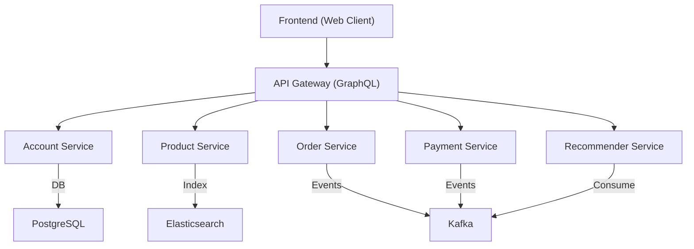

# 🧩 Nghiên cứu phát triển ứng dụng Web thương mại điện tử trên cơ sở Microservice sử dụng gRPC

Dự án này minh họa việc **xây dựng hệ thống thương mại điện tử** theo kiến trúc **Microservice** hiện đại, áp dụng các nguyên lý **Domain-Driven Design (DDD)** và **Clean Architecture**, sử dụng **gRPC** làm giao thức giao tiếp giữa các dịch vụ.  
Hệ thống được phát triển nhằm chứng minh tính khả thi, hiệu năng và khả năng mở rộng của mô hình microservice trong bối cảnh các ứng dụng TMĐT hiện đại.

---

## 📚 Mục lục
- [Tổng quan](#-tổng-quan)
- [Kiến trúc hệ thống](#-kiến-trúc-hệ-thống)
- [Các dịch vụ chính](#-các-dịch-vụ-chính)
- [Cài đặt và khởi chạy](#-cài-đặt-và-khởi-chạy)
- [Ví dụ truy vấn GraphQL](#-ví-dụ-truy-vấn-graphql)
- [Đóng góp & Tác giả](#-đóng-góp--tác-giả)
- [Giấy phép](#-giấy-phép)

---

## 🧭 Tổng quan

Hệ thống bao gồm nhiều **microservice độc lập**, mỗi dịch vụ đảm nhiệm một miền nghiệp vụ cụ thể.  
Các thành phần chính gồm:

- **Account Service (Go):** Quản lý tài khoản, xác thực và ủy quyền người dùng.  
- **Product Service (Go):** Quản lý sản phẩm, chỉ mục hóa dữ liệu trong **Elasticsearch**, phát sự kiện qua **Kafka**.  
- **Order Service (Go):** Quản lý đơn hàng, tính toán tổng giá trị, lưu trữ dữ liệu và xuất sự kiện Kafka.  
- **Payment Service (Go):** Xử lý thanh toán, đồng bộ hóa trạng thái đơn hàng.  
- **Recommender Service (Python):** Tiêu thụ sự kiện Kafka, phân tích dữ liệu và gợi ý sản phẩm.  
- **API Gateway (Go - GraphQL):** Cung cấp giao diện truy vấn thống nhất cho Frontend.  

Tất cả các dịch vụ được đóng gói trong **Docker**, với các thành phần dữ liệu bao gồm **PostgreSQL**, **Kafka**, và **Elasticsearch**.

---

## 🏗 Kiến trúc hệ thống



### Luồng giao tiếp:
- **API Gateway** (GraphQL) giao tiếp với các service qua **gRPC**.  
- **Product** và **Order** là các **Kafka producer**, trong khi **Payment** và **Recommender** là **Kafka consumer**.  
- **Recommender Service** tiêu thụ dữ liệu sự kiện để huấn luyện và gợi ý sản phẩm.  

---

## ⚙ Các dịch vụ chính

| Dịch vụ | Ngôn ngữ | Cơ sở dữ liệu | Chức năng chính |
|----------|-----------|----------------|------------------|
| **Account** | Go | PostgreSQL | Quản lý tài khoản, xác thực, JWT |
| **Product** | Go | Elasticsearch | CRUD sản phẩm, phát sự kiện Kafka |
| **Order** | Go | PostgreSQL | Tạo và xử lý đơn hàng |
| **Payment** | Go | PostgreSQL | Xử lý thanh toán, cập nhật trạng thái |
| **Recommender** | Python | PostgreSQL (Replica) | Gợi ý sản phẩm qua Kafka |
| **API Gateway** | Go (GraphQL) | - | Giao diện thống nhất cho client |

---

## 🚀 Cài đặt và khởi chạy

### ✅ Yêu cầu hệ thống
Trước khi chạy, cần cài đặt:
- [Docker](https://www.docker.com/get-started)
- [Docker Compose](https://docs.docker.com/compose/)
- [Git](https://git-scm.com/)

### 📥 Clone dự án
```bash
git clone https://github.com/lasion07/microservices-ecommerce-grpc.git
cd microservices-ecommerce-grpc
```

### 🐳 Khởi chạy toàn bộ hệ thống
```bash
# Bước 1: Xây dựng base image
docker compose build base

# Bước 2: Khởi động các dịch vụ
docker compose up -d --build
```

Sau khi khởi chạy, hệ thống sẽ bao gồm:
- Các dịch vụ **Go** (account, product, order, payment, graphql)
- Dịch vụ **Recommender** (Python)
- Các thành phần hạ tầng: **PostgreSQL**, **Kafka**, **Elasticsearch**

### 🌐 Truy cập giao diện GraphQL
- API endpoint: [http://localhost:8080/graphql](http://localhost:8080/graphql)  
- Playground: [http://localhost:8080/playground](http://localhost:8080/playground)

---

## 🧩 Ví dụ truy vấn GraphQL

### 🧑 Đăng ký tài khoản
```graphql
mutation {
  register(account: {
    name: "Nguyen Van A"
    email: "a@example.com"
    password: "123456"
  }) {
    token
  }
}
```

### 🔐 Đăng nhập
```graphql
mutation {
  login(account: {
    email: "a@example.com"
    password: "123456"
  }) {
    token
  }
}
```

### 📦 Tạo sản phẩm
```graphql
mutation {
  createProduct(product: {
    name: "Tai nghe Bluetooth"
    description: "Tai nghe không dây chất lượng cao"
    price: 49.99
  }) {
    id
    name
  }
}
```

### 🛒 Tạo đơn hàng
```graphql
mutation {
  createOrder(order: {
    products: [
      { id: "PRODUCT_ID", quantity: 2 }
    ]
  }) {
    id
    totalPrice
    products {
      name
      quantity
    }
  }
}
```

---

## 🤝 Đóng góp & Tác giả

Nhóm: 02
1. Nguyễn Minh Hiếu 2024700258
2. Lý Thành Lâm 2024700301
3. Phạm Vũ Minh Hoàng 2024700225


---

## 🪪 Giấy phép
Dự án được phát hành cho mục đích học tập và nghiên cứu,  
dựa trên mã nguồn mở của [Rauf Asadov – Ecommerce Microservices](https://github.com/rasadov/EcommerceAPI).  
Giấy phép: **Apache License 2.0**

---